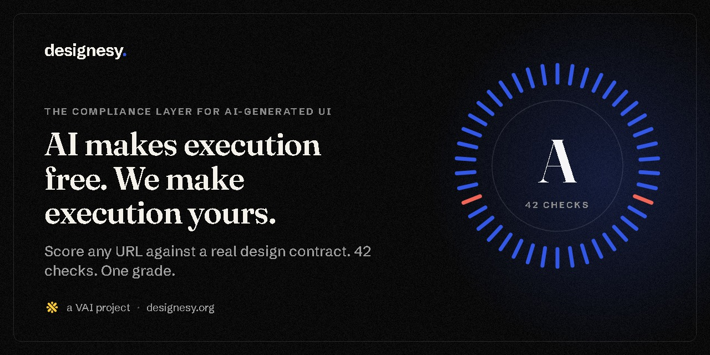
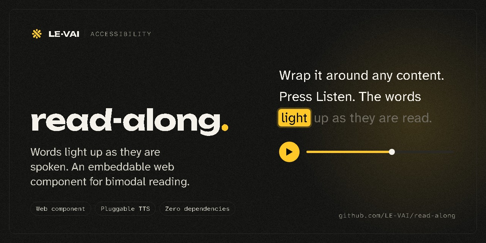
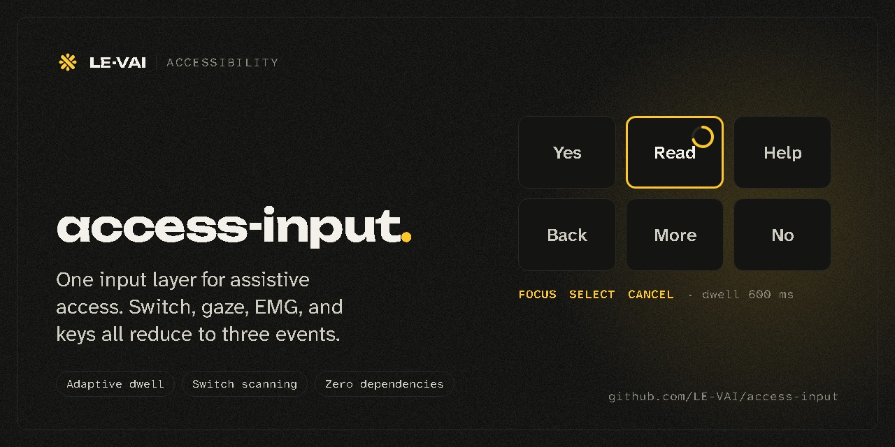
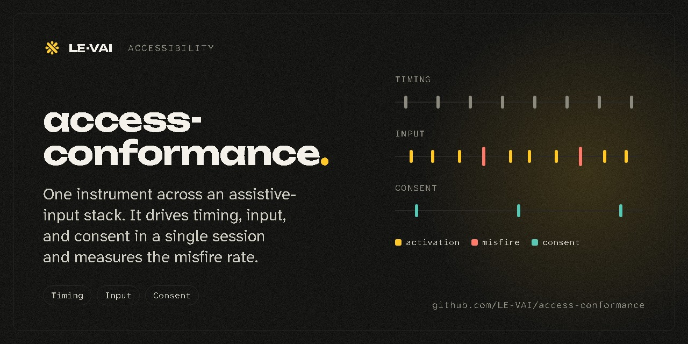
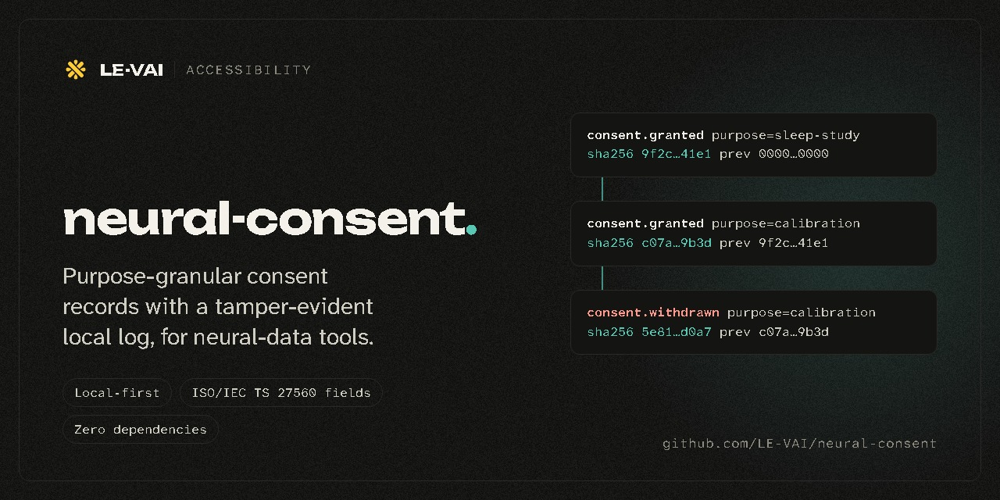
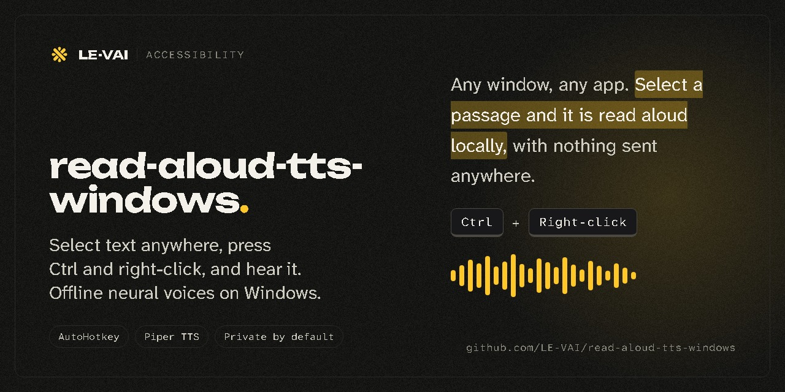
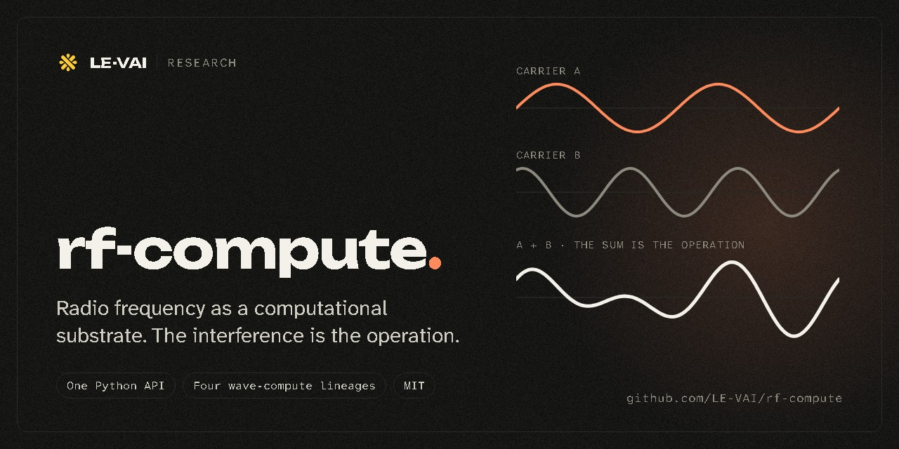
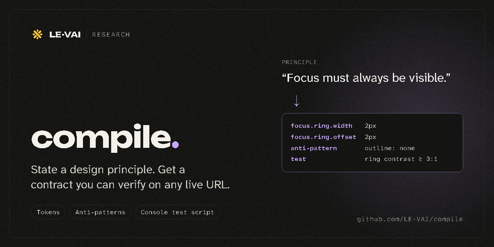

<picture>
  <source media="(prefers-color-scheme: dark)" srcset="assets/banner-dark.svg">
  <source media="(prefers-color-scheme: light)" srcset="assets/banner-light.svg">
  
</picture>

I build tools for people who drive a computer with a switch, their gaze, or a single muscle, and for the teams who need their interfaces to hold up. The accessibility libraries run locally, with zero dependencies.

## Product

**[designesy](https://www.designesy.org)** scores any URL against a real design contract, gates your CI on the result, and ships as an MCP server, a GitHub Action, a stylelint plugin, and a CLI.

## Accessibility

These libraries compose. access-input turns a switch, gaze, or EMG signal into three events, and those events drive read-along directly. Neither library knows the other's internals.

<table>
  <tr>
    <td width="50%"></td>
    <td width="50%"></td>
  </tr>
  <tr>
    <td width="50%"></td>
    <td width="50%"></td>
  </tr>
  <tr>
    <td colspan="2"></td>
  </tr>
</table>

## Research

<table>
  <tr>
    <td width="50%"></td>
    <td width="50%"></td>
  </tr>
</table>

Daily notes, experiments, and progress live in **[build-log](https://github.com/LE-VAI/build-log)**.
